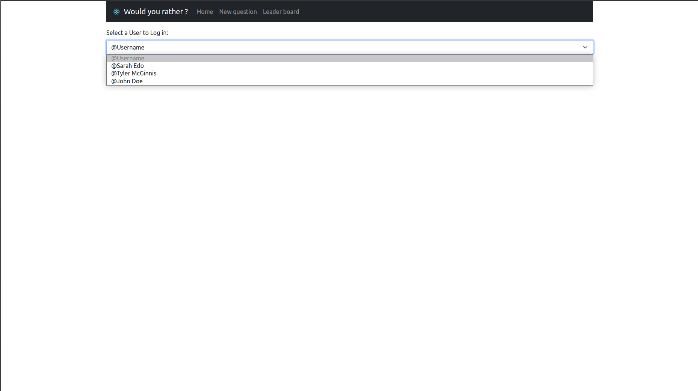
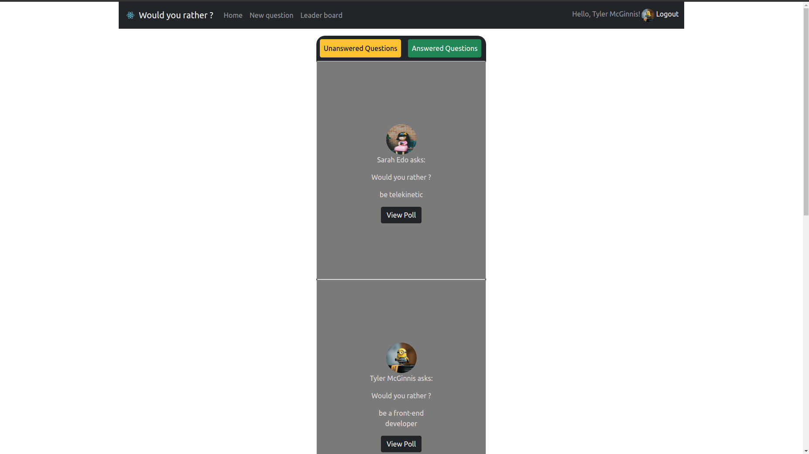
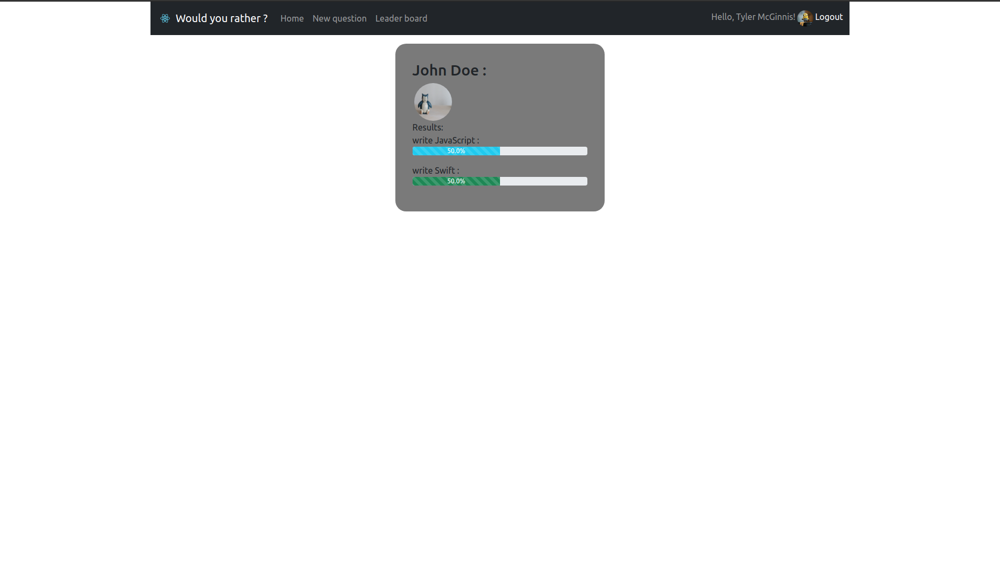
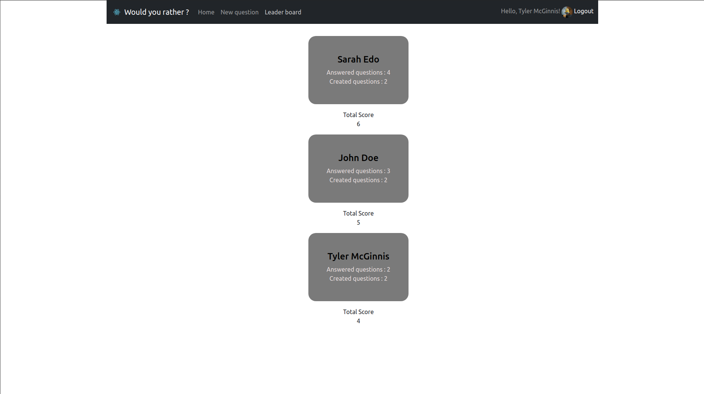
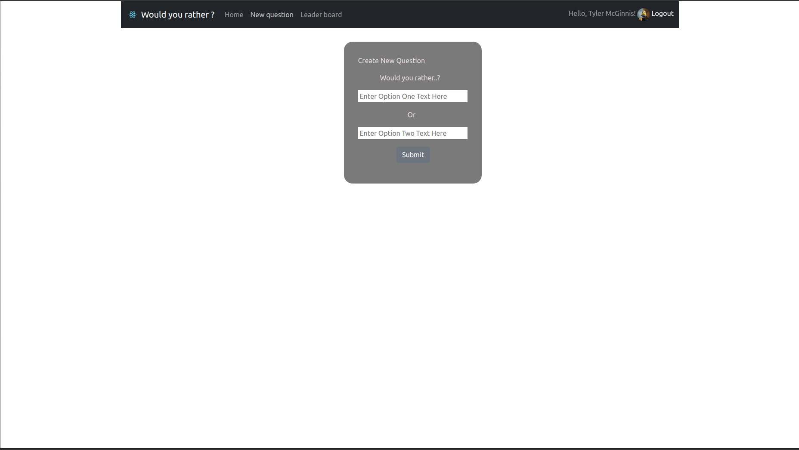

# Would you rather Project
<!-- markdownlint-capture -->
This is the second Udacity web developmenet {Professional track} ND program project

## Project overview:
- The would you rather is a game that allowes the user to choose between two options, and also get to create their own questions and check others questions and answers.
- The API file is given with nested object data that needs to be simplified to get the data correctly and manage passing the data properly and displaying it propely too. (i user Object.keys(), Object.values(), Object.entries(), and simplified the data by exporting certain functions separatly in a separate file with few needed data)
- I used React bootstrap :
    - - [npm install react-bootstrap@next bootstrap@5.0.2]
    - - npm, react-redux, react-router-dom and other needed tools.

- ### you can simply run the App by one of them:
* install all project dependencies with `npm install`
* start the development server with `npm start`

## Project Structure:

The main components are:
- #### The Home (dash board of answerd and unanswered questions by all users including the logged in user)
- #### The New Question page where the user have a form to fill in their two options and submit their questions to the list of questions not answered yet.
- #### The Scores page (leaderboard) where all users have their scores shown, the count of their answered questions and the count of the questions they created before

--- -------

## Screen shots for the App:
- ### Login view :
*To log in you must choose a user*

- ### Home view :
*Answered and unanswered questions both have lists that user can choose from*

- ### Answered Questions :
*answered questions have votes scores*

- ### Leader board view (Scores) :

- ### New questions (Scores) :

